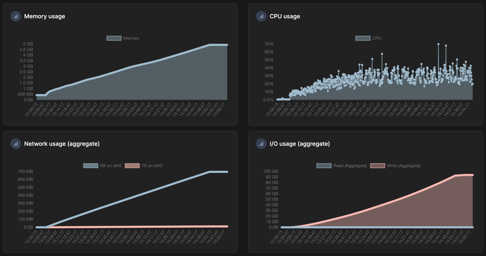

# 2 hours test

This test was made because of a request from Wilson Hauck for this kind of additional information on [the corresponding StackOverflow thread](https://stackoverflow.com/q/78523958/14266625).

I added a thread sleep of 0.5s to the script before running it, but even so, it finished inserting 10,000 bulks of 1000 rows after running for 1h50m.

Each folder in `test-2hours` contains info gathered from the Docker container some time after the script started, except `0-before` which contains info taken before that.

I only did this test with the docker container, but the constant memory growth seems to happen regardless of the underlying machine. It happened on my Linux laptop, on my M1 Macbook, and on my colleague's Linux server which eventually crashed.

## Docker graphs



The point where the graphs become flat corresponds to when the script stopped running (it lasted 1h50m).

> For some reason the CPU usage metrics stop at around 14:34 instead of 15:02, I don't know why.

## General info

`ulimit -a`

```
core file size          (blocks, -c) 0
data seg size           (kbytes, -d) unlimited
scheduling priority             (-e) 0
file size               (blocks, -f) unlimited
pending signals                 (-i) 31342
max locked memory       (kbytes, -l) unlimited
max memory size         (kbytes, -m) unlimited
open files                      (-n) 1048576
pipe size            (512 bytes, -p) 8
POSIX message queues     (bytes, -q) 819200
real-time priority              (-r) 0
stack size              (kbytes, -s) 8192
cpu time               (seconds, -t) unlimited
max user processes              (-u) unlimited
virtual memory          (kbytes, -v) unlimited
file locks                      (-x) unlimited
```

***

`df -i`

```
Filesystem                                     Inodes   IUsed      IFree IUse% Mounted on
overlay                                       3907584   33104    3874480    1% /
tmpfs                                         1003656      16    1003640    1% /dev
shm                                           1003656       1    1003655    1% /dev/shm
/dev/vda1                                     3907584   33104    3874480    1% /etc/hosts
/run/host_mark/Users/speykious/docker-conf 1021530273 1072993 1020457280    1% /etc/mysql/conf.d/my.cnf
tmpfs                                         1003656       1    1003655    1% /sys/firmware
```
